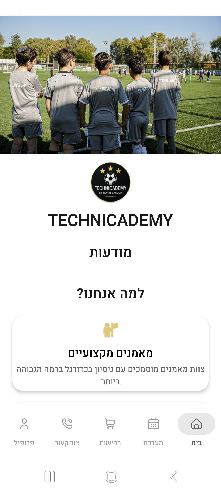
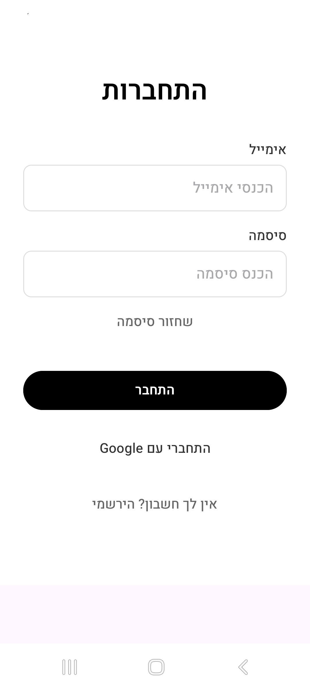
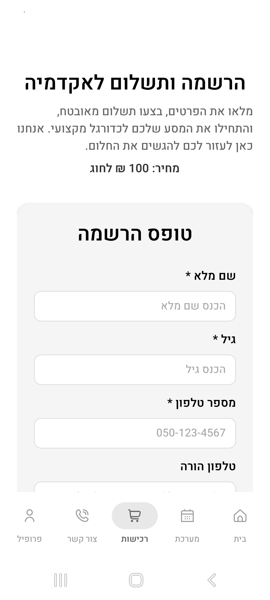
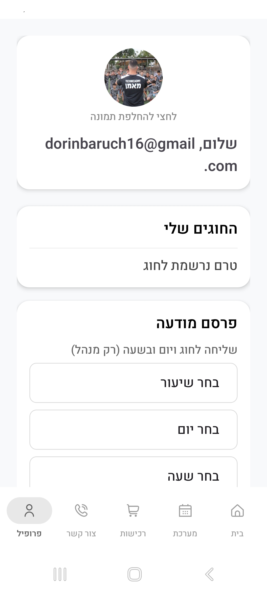
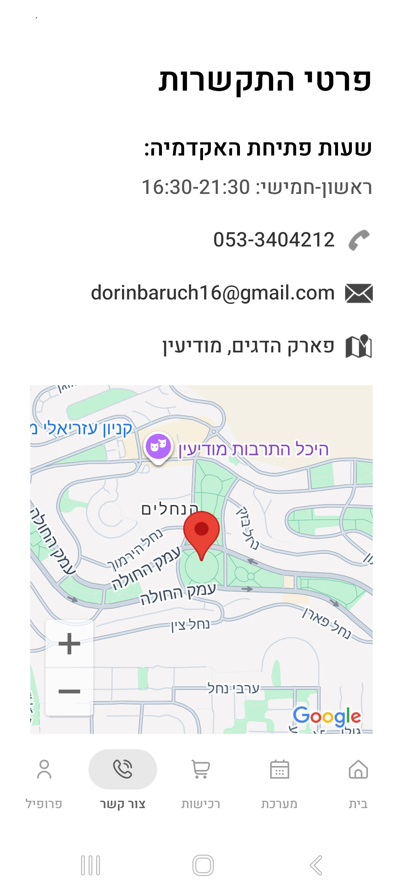
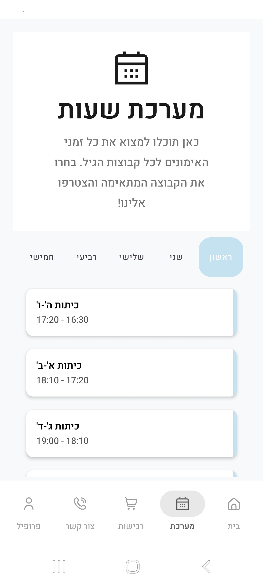

# ⚽ Technicademy

אפליקציית Android לאקדמיית כדורגל – הרשמה לחוגים, מערכת שעות, לוח חגים, מודעות וניהול פרופיל משתמש.

הפרויקט נבנה בקוטלין עם הפרדה ברורה לשכבות (data / service / ui) ומתאים כפרויקט פורטפוליו. 

---

## 🎯 סקירה כללית

- **דף הבית** – מודעות כלליות מהאקדמיה.
- **הרשמה ותשלום** – טופס הרשמה לחוג, בחירת יום אימון, סיכום ומחיר.
- **מערכת שעות** – טאבים לפי ימים, רשימת שיעורים וצבעים לפי קבוצה.
- **צור קשר** – מפה עם מיקום האימונים (פארק הדגים, מודיעין).
- **פרופיל** – פרטי משתמש, החוגים שלי, תמונת פרופיל, פרסום מודעות (למנהל).

---

## ✨ פיצ'רים עיקריים

#### 🔐 התחברות ומשתמשים

- **התחברות** באימייל וסיסמה או עם **Google Sign-In** (Firebase Auth).
- **הרשמת משתמש חדש** עם אימות סיסמה.
- **שחזור סיסמה** בדיאלוג ייעודי.
- אחרי התחברות – מעבר אוטומטי ל**אזור האישי** (פרופיל).

#### 📅 הרשמה לחוגים ותשלום

- **בחירת חוג ויום אימון** מתוך מערכת השעות.
- **מחיר אחיד**  לחוג (קבוע במערכת, מוצג בהרשמה ובמסך התשלום).
- **שמירת הרשמות** לפי משתמש (SharedPreferences דרך שכבת Service).
- דיאלוג **הצלחה** עם מעבר לפרופיל.

#### 📢 מודעות

- **מודעות כלליות** – מופיעות בעמוד הבית.
- **מודעות ממוקדות** – למנהל: שליחה לחוג ויום מסוים (רק לנרשמים).
- שמירה מקומית (JSON + SharedPreferences).

#### 🗓️ מערכת שעות

- **טאבים** לפי ימים (ראשון–חמישי) עם רשימת שיעורים וצבעים.

#### 👤 פרופיל ומנהל

- **תמונת פרופיל** – בחירה מגלריה, שמירה לפי משתמש.
- **החוגים שלי** – טקסט שמציג את פרטי ההרשמות.
- **מנהל** (לפי אימייל): איפוס הרשמות, מחיקת מודעות, פרסום מודעות ממוקדות.

---

## 🏗️ ארכיטקטורה ומבנה חבילות

הפרויקט מאורגן ב-**packages** להפרדה בין שכבות:

```
com.example.technicademy/
├── data/                      # שכבת נתונים
│   ├── api/                   # API חיצוני
│   │   └── HebcalApi.kt       # Hebcal – חגים
│   ├── model/                 # מודלים
│   │   ├── Announcement.kt
│   │   ├── TrainingSession.kt
│   │   ├── HolidayResponse.kt, HolidayItem.kt
│   ├── repository/
│   │   └── AnnouncementStorage.kt
│   └── ScheduleData.kt        # מערכת שעות + מחיר לחוג
│
├── service/                   # שירותים (הפרדת תשתית)
│   ├── UserPreferencesService.kt
│   └── UserPreferencesServiceImpl.kt   # גישה ל-SharedPreferences
│
└── ui/
    ├── MainActivity.kt        # Activity ראשי + Bottom Navigation
    ├── fragments/             # מסכים
    │   ├── HomeFragment, LoginFragment, RegisterUserFragment
    │   ├── ProfileFragment, RegisterFragment, PaymentFragment
    │   ├── ContactFragment, ScheduleFragment, HolidaysFragment
    └── adapters/              # RecyclerView Adapters
        ├── AnnouncementAdapter.kt
        ├── ScheduleAdapter.kt
        └── HolidayAdapter.kt
```

- **data** – מודלים, API, repository (אחסון מודעות).
- **service** – הפרדת שירותים חיצוניים (למשל SharedPreferences).
- **ui** – Activity, Fragments, Adapters.

---

## 🛠️ טכנולוגיות

| תחום | טכנולוגיה |
|------|------------|
| שפה & פלטפורמה | **Kotlin**, **Android SDK** |
| עיצוב | **Material 3**, **Bottom Navigation** (טאב נבחר באפור) |
| התחברות | **Firebase Auth** (אימייל + Google Sign-In) |
| רשת | **Retrofit**, **Gson** (Hebcal API) |
| אחסון מקומי | **SharedPreferences** (דרך `UserPreferencesService`) |
| מפה | **Google Maps** (צור קשר) |

---

## 🚀 הרצה

1. לפתוח את הפרויקט ב-**Android Studio**.
2. לוודא ש-**Firebase** מוגדר (קובץ `google-services.json` אם נדרש).
3. להריץ: **Run** מ-IDE או `./gradlew assembleDebug` מהתיקייה הראשית.

---

## 📸 Screenshots

<p align="center">
  
  
  
</p>

<p align="center">
  <b>Home</b> &nbsp;&nbsp;&nbsp;&nbsp;&nbsp;&nbsp;&nbsp;&nbsp;&nbsp;&nbsp;&nbsp;&nbsp;&nbsp;&nbsp;&nbsp;&nbsp;&nbsp;&nbsp;&nbsp;&nbsp;
  <b>Login</b> &nbsp;&nbsp;&nbsp;&nbsp;&nbsp;&nbsp;&nbsp;&nbsp;&nbsp;&nbsp;&nbsp;&nbsp;&nbsp;&nbsp;&nbsp;&nbsp;&nbsp;&nbsp;&nbsp;&nbsp;
  <b>Register</b>
</p>

<p align="center">
  
  
  
</p>

<p align="center">
  <b>Profile</b> &nbsp;&nbsp;&nbsp;&nbsp;&nbsp;&nbsp;&nbsp;&nbsp;&nbsp;&nbsp;&nbsp;&nbsp;&nbsp;&nbsp;&nbsp;&nbsp;&nbsp;&nbsp;&nbsp;&nbsp;
  <b>Contact</b> &nbsp;&nbsp;&nbsp;&nbsp;&nbsp;&nbsp;&nbsp;&nbsp;&nbsp;&nbsp;&nbsp;&nbsp;&nbsp;&nbsp;&nbsp;&nbsp;&nbsp;&nbsp;&nbsp;&nbsp;
  <b>Schedule</b>
</p>

---


